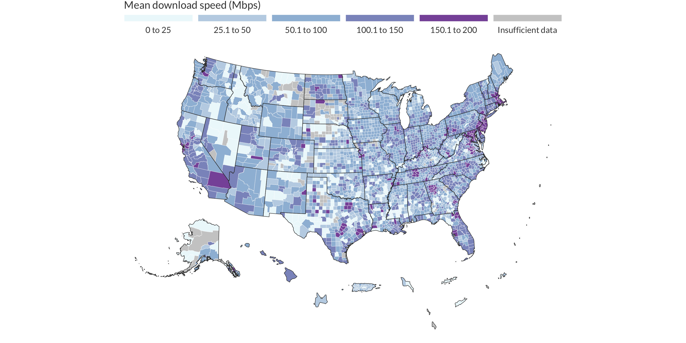

Analyzing download speeds in Kentucky counties
================

In this tutorial I will talk about how to:

  - Download the Ookla open dataset
  - Geocode the tiles to Kentucky counties
  - Make a table of the top and bottom 20 counties by download speed
  - And map the counties

There are two main ways to join these tiles to another geographic
dataset: quadkeys and spatial joins. This tutorial will use the spatial
join approach.

``` r
library(tigris) # county boundaries
library(tidyverse) # data cleaning
library(sf) # spatial functions
library(knitr)
library(kableExtra)
library(RColorBrewer)
library(here)
library(usethis)
```

## Download data

First, download the data to a local directory

``` r
# download the zip folder from s3 and save to working directory
# use_zip("https://ookla-open-data.s3-us-west-2.amazonaws.com/shapefiles/performance/type%3Dfixed/year%3D2020/quarter%3D2/2020-04-01_performance_fixed_tiles.zip")

#read the shapefile. 
tiles <- read_sf(here("2020-04-01_performance_fixed_tiles/gps_fixed_tiles.shp")) %>%
  mutate(avg_d_kbps = as.numeric(avg_d_kbps),
         avg_u_kbps = as.numeric(avg_u_kbps),
         avg_lat_ms = as.numeric(avg_lat_ms))
```

## Get county boundaries

Then, I’ll load the Kentucky county boundaries from the U.S. Census
Bureau via `tigris`.

``` r
ky_counties <- tigris::counties(state = "Kentucky") %>%
  select(state_code = STATEFP, geoid = GEOID, name = NAME) %>% # only keep useful variables 
  st_transform(4326) # transform to the same CRS as the tiles
```

## Join tiles to counties

Now I’ll join the tiles to the counties. I use `left = FALSE` because I
only want to include counties that have at least 1 tile.

``` r
tiles_in_ky_counties <- st_join(ky_counties, tiles, left = FALSE)
```

## Calculate statistics

Once the datasets are joined, we are interested in summary statistics at
the county level. Since we know the average download speed per tile, we
could just do a simple average. To make it more accurate, I’ll use a
weighted mean, weighted by test count. This gives us the overall mean in
the county if the data hadn’t been aggregated to tiles first. I’ve also
included weighted means for upload speed and latency here as well.

``` r
county_stats <- tiles_in_ky_counties %>%
  st_set_geometry(NULL) %>%
  group_by(state_code, geoid, name) %>%
  summarise(mean_dl_mbps_wt = weighted.mean(avg_d_kbps, tests) / 1000,
            mean_ul_mbps_wt = weighted.mean(avg_u_kbps, tests) / 1000,
            mean_lat_ms_wt = weighted.mean(avg_lat_ms, tests),
            tests = sum(tests)) %>%
  ungroup() %>%
  left_join(fips_codes %>% 
              mutate(geoid = paste0(state_code, county_code)) %>% 
              # get nicer county and state names
              select(state, geoid, long_name = county, county), by = c("geoid")) 
```

## Make a table of the top 20 and bottom 20 counties

Next we can make a summary table of just the best and worst counties.
We’ll require that counties have at least 50 tests so that the
averages are more reliable. I use `kable()` here for simplicity, but you
could use any of the R packages that help with tables.

``` r
table_data <- county_stats %>%
  filter(tests >= 50) %>%
  mutate(rank = min_rank(-mean_dl_mbps_wt)) %>% # rank in descending order
  dplyr::filter(rank <= 20 | rank >= n() - 19) %>%
  mutate(`County` = paste0(long_name, ", ", state),
         mean_dl_mbps_wt = round(mean_dl_mbps_wt, 2)) %>%
  arrange(rank) %>%
  select(`County`, `Average download speed (Mbps)` = mean_dl_mbps_wt, `Tests` = tests, `Rank` = rank)

kable(table_data, format.args = list(big.mark = ","))
```

<table>

<thead>

<tr>

<th style="text-align:left;">

County

</th>

<th style="text-align:right;">

Average download speed (Mbps)

</th>

<th style="text-align:right;">

Tests

</th>

<th style="text-align:right;">

Rank

</th>

</tr>

</thead>

<tbody>

<tr>

<td style="text-align:left;">

Jefferson County, KY

</td>

<td style="text-align:right;">

159.02

</td>

<td style="text-align:right;">

72,699

</td>

<td style="text-align:right;">

1

</td>

</tr>

<tr>

<td style="text-align:left;">

Fayette County, KY

</td>

<td style="text-align:right;">

154.13

</td>

<td style="text-align:right;">

50,730

</td>

<td style="text-align:right;">

2

</td>

</tr>

<tr>

<td style="text-align:left;">

Scott County, KY

</td>

<td style="text-align:right;">

151.21

</td>

<td style="text-align:right;">

6,632

</td>

<td style="text-align:right;">

3

</td>

</tr>

<tr>

<td style="text-align:left;">

Martin County, KY

</td>

<td style="text-align:right;">

150.30

</td>

<td style="text-align:right;">

1,489

</td>

<td style="text-align:right;">

4

</td>

</tr>

<tr>

<td style="text-align:left;">

Christian County, KY

</td>

<td style="text-align:right;">

146.73

</td>

<td style="text-align:right;">

5,365

</td>

<td style="text-align:right;">

5

</td>

</tr>

<tr>

<td style="text-align:left;">

Oldham County, KY

</td>

<td style="text-align:right;">

144.92

</td>

<td style="text-align:right;">

9,787

</td>

<td style="text-align:right;">

6

</td>

</tr>

<tr>

<td style="text-align:left;">

Gallatin County, KY

</td>

<td style="text-align:right;">

144.21

</td>

<td style="text-align:right;">

673

</td>

<td style="text-align:right;">

7

</td>

</tr>

<tr>

<td style="text-align:left;">

Madison County, KY

</td>

<td style="text-align:right;">

144.17

</td>

<td style="text-align:right;">

6,097

</td>

<td style="text-align:right;">

8

</td>

</tr>

<tr>

<td style="text-align:left;">

Clark County, KY

</td>

<td style="text-align:right;">

144.07

</td>

<td style="text-align:right;">

2,525

</td>

<td style="text-align:right;">

9

</td>

</tr>

<tr>

<td style="text-align:left;">

Bell County, KY

</td>

<td style="text-align:right;">

143.69

</td>

<td style="text-align:right;">

1,165

</td>

<td style="text-align:right;">

10

</td>

</tr>

<tr>

<td style="text-align:left;">

Pendleton County, KY

</td>

<td style="text-align:right;">

141.33

</td>

<td style="text-align:right;">

633

</td>

<td style="text-align:right;">

11

</td>

</tr>

<tr>

<td style="text-align:left;">

Warren County, KY

</td>

<td style="text-align:right;">

141.17

</td>

<td style="text-align:right;">

11,759

</td>

<td style="text-align:right;">

12

</td>

</tr>

<tr>

<td style="text-align:left;">

Grant County, KY

</td>

<td style="text-align:right;">

140.04

</td>

<td style="text-align:right;">

1,355

</td>

<td style="text-align:right;">

13

</td>

</tr>

<tr>

<td style="text-align:left;">

Woodford County, KY

</td>

<td style="text-align:right;">

138.50

</td>

<td style="text-align:right;">

5,933

</td>

<td style="text-align:right;">

14

</td>

</tr>

<tr>

<td style="text-align:left;">

Kenton County, KY

</td>

<td style="text-align:right;">

137.51

</td>

<td style="text-align:right;">

13,883

</td>

<td style="text-align:right;">

15

</td>

</tr>

<tr>

<td style="text-align:left;">

McCreary County, KY

</td>

<td style="text-align:right;">

137.23

</td>

<td style="text-align:right;">

634

</td>

<td style="text-align:right;">

16

</td>

</tr>

<tr>

<td style="text-align:left;">

Boone County, KY

</td>

<td style="text-align:right;">

135.33

</td>

<td style="text-align:right;">

15,704

</td>

<td style="text-align:right;">

17

</td>

</tr>

<tr>

<td style="text-align:left;">

Campbell County, KY

</td>

<td style="text-align:right;">

134.47

</td>

<td style="text-align:right;">

7,576

</td>

<td style="text-align:right;">

18

</td>

</tr>

<tr>

<td style="text-align:left;">

Bullitt County, KY

</td>

<td style="text-align:right;">

132.58

</td>

<td style="text-align:right;">

8,526

</td>

<td style="text-align:right;">

19

</td>

</tr>

<tr>

<td style="text-align:left;">

Spencer County, KY

</td>

<td style="text-align:right;">

132.34

</td>

<td style="text-align:right;">

1,872

</td>

<td style="text-align:right;">

20

</td>

</tr>

<tr>

<td style="text-align:left;">

Rockcastle County, KY

</td>

<td style="text-align:right;">

39.15

</td>

<td style="text-align:right;">

1,083

</td>

<td style="text-align:right;">

97

</td>

</tr>

<tr>

<td style="text-align:left;">

Monroe County, KY

</td>

<td style="text-align:right;">

37.63

</td>

<td style="text-align:right;">

681

</td>

<td style="text-align:right;">

98

</td>

</tr>

<tr>

<td style="text-align:left;">

Butler County, KY

</td>

<td style="text-align:right;">

37.07

</td>

<td style="text-align:right;">

407

</td>

<td style="text-align:right;">

99

</td>

</tr>

<tr>

<td style="text-align:left;">

Green County, KY

</td>

<td style="text-align:right;">

36.11

</td>

<td style="text-align:right;">

915

</td>

<td style="text-align:right;">

100

</td>

</tr>

<tr>

<td style="text-align:left;">

Perry County, KY

</td>

<td style="text-align:right;">

35.74

</td>

<td style="text-align:right;">

4,348

</td>

<td style="text-align:right;">

101

</td>

</tr>

<tr>

<td style="text-align:left;">

Livingston County, KY

</td>

<td style="text-align:right;">

34.60

</td>

<td style="text-align:right;">

728

</td>

<td style="text-align:right;">

102

</td>

</tr>

<tr>

<td style="text-align:left;">

Garrard County, KY

</td>

<td style="text-align:right;">

34.03

</td>

<td style="text-align:right;">

2,252

</td>

<td style="text-align:right;">

103

</td>

</tr>

<tr>

<td style="text-align:left;">

Wayne County, KY

</td>

<td style="text-align:right;">

32.78

</td>

<td style="text-align:right;">

2,659

</td>

<td style="text-align:right;">

104

</td>

</tr>

<tr>

<td style="text-align:left;">

Breckinridge County, KY

</td>

<td style="text-align:right;">

31.20

</td>

<td style="text-align:right;">

1,500

</td>

<td style="text-align:right;">

105

</td>

</tr>

<tr>

<td style="text-align:left;">

Harlan County, KY

</td>

<td style="text-align:right;">

30.28

</td>

<td style="text-align:right;">

2,024

</td>

<td style="text-align:right;">

106

</td>

</tr>

<tr>

<td style="text-align:left;">

Leslie County, KY

</td>

<td style="text-align:right;">

29.07

</td>

<td style="text-align:right;">

1,303

</td>

<td style="text-align:right;">

107

</td>

</tr>

<tr>

<td style="text-align:left;">

Lyon County, KY

</td>

<td style="text-align:right;">

28.46

</td>

<td style="text-align:right;">

1,042

</td>

<td style="text-align:right;">

108

</td>

</tr>

<tr>

<td style="text-align:left;">

Knott County, KY

</td>

<td style="text-align:right;">

27.19

</td>

<td style="text-align:right;">

2,426

</td>

<td style="text-align:right;">

109

</td>

</tr>

<tr>

<td style="text-align:left;">

Letcher County, KY

</td>

<td style="text-align:right;">

26.68

</td>

<td style="text-align:right;">

3,061

</td>

<td style="text-align:right;">

110

</td>

</tr>

<tr>

<td style="text-align:left;">

Casey County, KY

</td>

<td style="text-align:right;">

26.28

</td>

<td style="text-align:right;">

727

</td>

<td style="text-align:right;">

111

</td>

</tr>

<tr>

<td style="text-align:left;">

Bracken County, KY

</td>

<td style="text-align:right;">

24.30

</td>

<td style="text-align:right;">

535

</td>

<td style="text-align:right;">

112

</td>

</tr>

<tr>

<td style="text-align:left;">

Breathitt County, KY

</td>

<td style="text-align:right;">

23.16

</td>

<td style="text-align:right;">

1,197

</td>

<td style="text-align:right;">

113

</td>

</tr>

<tr>

<td style="text-align:left;">

Lee County, KY

</td>

<td style="text-align:right;">

22.90

</td>

<td style="text-align:right;">

130

</td>

<td style="text-align:right;">

114

</td>

</tr>

<tr>

<td style="text-align:left;">

Hickman County, KY

</td>

<td style="text-align:right;">

20.42

</td>

<td style="text-align:right;">

192

</td>

<td style="text-align:right;">

115

</td>

</tr>

<tr>

<td style="text-align:left;">

Hancock County, KY

</td>

<td style="text-align:right;">

12.35

</td>

<td style="text-align:right;">

359

</td>

<td style="text-align:right;">

116

</td>

</tr>

</tbody>

</table>

## And we can also make a map of these counties

The table is good for a quick glance at overall patterns (what are the
overall maxima and minima? where is the fastest speed?) but unless
you’re already familiar with these areas it can be hard to picture
where they are on a map. To go along with the table we can produce a
quick choropleth map that will help give a more visual representation.

We can join our county statistics table to the basemap (remember, we
already got rid of the geometry from that county statistics table). I’m
also creating a categorical variable from the continuous download speed
because people aren’t great at reading continuous color schemes. People
can read discrete legends much more easily, with 7 categories maximum
(this can depend on the situation, though).

``` r
county_stats_sf <- ky_counties %>%
  select(geoid) %>%
  left_join(county_stats %>% mutate(geoid = as.character(geoid)), by = c("geoid")) %>%
  mutate(mean_dl_mbps_wt = case_when(tests < 50 ~ NA_real_,
                            TRUE ~ mean_dl_mbps_wt)) %>% # at least 50 tests
  mutate(dl_cat = cut(mean_dl_mbps_wt, c(0, 25, 50, 100, 150, 200), ordered_result = TRUE))

ggplot() +
  geom_sf(data = county_stats_sf, aes(fill = dl_cat), color = "white", lwd = 0.1) +
  theme_void() +
  scale_fill_manual(values = brewer.pal(n = 6, name = "BuPu"),  
                    na.value = "gray80", 
                    labels = c("0 to 25", "25.1 to 50", "50.1 to 100", "100.1 to 150", "150.1 to 200", "Insufficient data"), 
                    name = "Mean download speed (Mbps)", 
                    guide = guide_legend(direction = "horizontal", title.position = "top", nrow = 1, label.position = "bottom", keyheight = 0.5, keywidth = 5)) +
  theme(text = element_text(color = "gray25"),
        legend.position = "top")
```

<!-- -->

``` r
sessionInfo()
```

    ## R version 3.6.1 (2019-07-05)
    ## Platform: x86_64-apple-darwin15.6.0 (64-bit)
    ## Running under: macOS Mojave 10.14.6
    ## 
    ## Matrix products: default
    ## BLAS:   /Library/Frameworks/R.framework/Versions/3.6/Resources/lib/libRblas.0.dylib
    ## LAPACK: /Library/Frameworks/R.framework/Versions/3.6/Resources/lib/libRlapack.dylib
    ## 
    ## locale:
    ## [1] en_US.UTF-8/en_US.UTF-8/en_US.UTF-8/C/en_US.UTF-8/en_US.UTF-8
    ## 
    ## attached base packages:
    ## [1] stats     graphics  grDevices utils     datasets  methods   base     
    ## 
    ## other attached packages:
    ##  [1] usethis_1.6.1      here_0.1           RColorBrewer_1.1-2 kableExtra_1.1.0  
    ##  [5] knitr_1.29         sf_0.8-0           forcats_0.5.0      stringr_1.4.0     
    ##  [9] dplyr_1.0.2        purrr_0.3.4        readr_1.3.1        tidyr_1.1.0       
    ## [13] tibble_3.0.1       ggplot2_3.3.2      tidyverse_1.3.0    tigris_1.0        
    ## 
    ## loaded via a namespace (and not attached):
    ##  [1] httr_1.4.2         jsonlite_1.7.0     viridisLite_0.3.0  modelr_0.1.8      
    ##  [5] assertthat_0.2.1   highr_0.8          sp_1.3-2           blob_1.2.1        
    ##  [9] cellranger_1.1.0   yaml_2.2.1         pillar_1.4.4       backports_1.1.8   
    ## [13] lattice_0.20-38    glue_1.4.1         uuid_0.1-2         digest_0.6.25     
    ## [17] rvest_0.3.5        colorspace_1.4-1   htmltools_0.5.0    pkgconfig_2.0.3   
    ## [21] broom_0.5.6        haven_2.3.1        scales_1.1.1       webshot_0.5.1     
    ## [25] farver_2.0.3       generics_0.0.2     ellipsis_0.3.1     withr_2.2.0       
    ## [29] cli_2.0.2          magrittr_1.5       crayon_1.3.4       readxl_1.3.1      
    ## [33] maptools_0.9-8     evaluate_0.14      fs_1.4.2           fansi_0.4.1       
    ## [37] nlme_3.1-140       xml2_1.3.2         foreign_0.8-71     class_7.3-15      
    ## [41] tools_3.6.1        hms_0.5.3          lifecycle_0.2.0    munsell_0.5.0     
    ## [45] reprex_0.3.0       compiler_3.6.1     e1071_1.7-3        rlang_0.4.7       
    ## [49] classInt_0.4-2     units_0.6-5        grid_3.6.1         rstudioapi_0.11   
    ## [53] rappdirs_0.3.1     rmarkdown_2.3      gtable_0.3.0       DBI_1.1.0         
    ## [57] curl_4.3           R6_2.4.1           lubridate_1.7.9    rgdal_1.4-6       
    ## [61] rprojroot_1.3-2    KernSmooth_2.23-15 stringi_1.4.6      Rcpp_1.0.3        
    ## [65] vctrs_0.3.4        dbplyr_1.4.4       tidyselect_1.1.0   xfun_0.15
